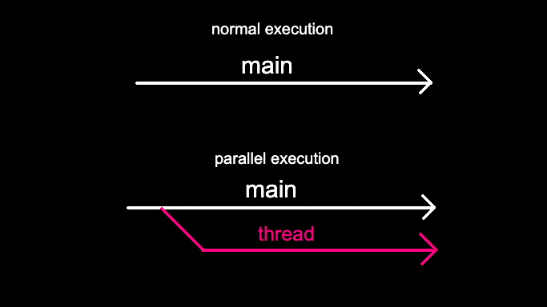

# Dining Philosophers

  

If you like me never heard about the Dining Philosophers, I suggest to read the [relative Wikipedia page](https://en.wikipedia.org/wiki/Dining_philosophers_problem).

The difference between the problem and the subject is the time limit: the philosophers can't stay too much without eating, the eating action need a while to be done, like also sleeping. All these variables are set runtime, and has to be parsed and checked.
Every philo (in the mandatory part) has to be a thread. The thread is a part of code execute in parallel. This thing is very useful as it allows us to take full advantage of the multithreaded technology of current processors.

[Short introduction to thread](https://code-vault.net/course/6q6s9eerd0:1609007479575/lesson/18ec1942c2da46840693efe9b51d86a8)

  

With this concept, is important to understand that using variable share between more thread can be dangerous: the parallel execution is not actual, but execute one per time. This implies that the share variables could be modify impropely, causing errors, so is important to prioritize them. This means that when a variable is used by a thread, has to be lock, so no others can use them. Mutexes are used for this purpose.

[example of problems with share variable](https://code-vault.net/course/6q6s9eerd0:1609007479575/lesson/18ec1942c2da46840693efe9b51ea1a2)   
[using mutexes](https://code-vault.net/course/6q6s9eerd0:1609007479575/lesson/18ec1942c2da46840693efe9b51eabf6)

## Tests
| test | expected output |
|----------|-------|
| ./philo 1 200 200 200 | philo 1 must take a fork and die in 210 ms |
| ./philo 2 800 200 200 | nobody must die |
| ./philo 5 800 200 200 | nobody must die |
| ./philo 5 800 200 200 7 | the simulation must stop when every philo eat at least 7 times |
| ./philo 5 500 200 200 7 | a philo must die before stopping the simulation |
| ./philo 4 410 200 200 | nobody must die |
| ./philo 4 310 200 200 | one philo must die |
| ./philo 4 500 200 1.2 | invalid argument |
| ./philo 4 0 200 200 | invalid argument |
| ./philo 4 -500 200 200 | invalid argument |
| ./philo 4 500 200 2147483647 | a philo must die in 510 ms |
| ./philo 4 2147483647 200 200 | nobody must die |
| ./philo 4 214748364732 200 200 | invalid argument|
| ./philo 4 200 210 200 | one philo must die, the message must be printed in 210 ms |
