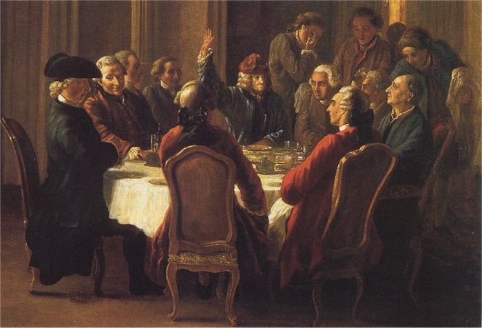

# Dining Philosophers

  

If you like me never heard about the Dining Philosophers, I suggest to read the [relative Wikipedia page](https://en.wikipedia.org/wiki/Dining_philosophers_problem).

The difference between the problem and the subject is the time limit: the philosophers can't stay too much without eating, the eating action need a while to be done, like also sleeping. All these variables are set runtime, and has to be parsed and checked.
Every philo (in the mandatory part) has to be a thread. The thread is a part of code execute in parallel, very interesting and usefull, 
